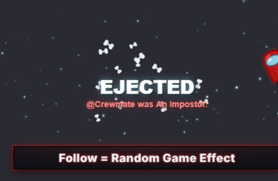

# Among Us Follow Overlay, Emergency Meeting

An **Among Us** TikTok follow overlay. A dark spaceship-HUD bar, *Follow = Random Game Effect*, sits bottom-centre with a crewmate-red trim,
alarm-pulse glow and a faint visor-glass sheen. Bean-shaped crewmates peek up on
idle, a TikFinity **follow** triggers a six-phase **ejection** celebration
(crewmate pops up → EMERGENCY MEETING alarm → ejection flash → flung spinning
into the starfield → giant *EJECTED* + impostor verdict), and an
emergency-meeting placard tracks the crewmate count.

Built on the canonical Fallout 4 / Pip-Boy template, the engine is preserved
1:1 (440×260 stage, pulsing bar, 440×224 above-bar FX canvas, idle peek-up
sprites in round-robin, phased celebration timeline, screen shake, follower
counter sign, floating promo text, demo panel, TikFinity WebSocket at
`ws://localhost:21213/`). The bar is **text-only** and every sprite is
hand-drawn on canvas in authentic Among Us colours, **no AI / Replicate art, no
external asset files**. Single self-contained file. Font: **Inter** (600/800).

---

## Quick start (OBS)

1. **Sources → + → Browser**.
2. **URL**: `https://aquilo.gg/personal-overlays/follow-amongus/`
   (backup: local `file:///…/aquilo-gg/overlays/follow-amongus/index.html`).
3. **Width `1280`, Height `720`** (or your canvas size), the bar anchors
   bottom-centre, the placard and starfield particles fill the canvas above it.
4. Tick **Shutdown source when not visible** + **Refresh browser when scene
   becomes active**.
5. The demo panel is **hidden by default**, add `?demo=1` to the URL to show it
   while testing, or press **H** to toggle.

## Idle peek roster (round-robin)

Red · Blue · Green · Yellow · Pink · Cyan crewmates (bean body, light-blue
visor + highlight, backpack bump, leg notch) · Impostor (dark menacing bean,
red visor glint + fangs) · Emergency button (red dome on a metal table). A wire-
matching task panel (`wires`) is also in the sprite map for contact sheets.
Each is code-drawn with a 2.5D extrude, red glow and clipped glass sheen.

## Follow celebration (≈3s)

`popIn 500 · idle 400 · charge 750 · boom 200 · smoke 850 · fade 300` ms, a random-colour crewmate bounces up and hovers, an *EMERGENCY MEETING* red flash
with a pulsing red vignette + alarm static ramps the stage shake, then an
ejection flash + expanding ring flings the crewmate spinning sideways into the
starfield while floating **bones** and drifting **stars** scatter, and a giant
*EJECTED* headline drops with an alternating verdict, *"@USERNAME was An
Impostor."* / *"@USERNAME was not An Impostor."*, before a quadratic fade back
to idle. Thank-you: *"@USERNAME has boarded the ship."*

## URL params

| param | effect |
|-------|--------|
| `?demo=1` | show the demo panel (hidden by default for OBS) |
| `?particles=stars` *(default)* `\|dust\|none` | ambient particle layer |
| `?cycle=off` | don't cycle batch names on the placard sign |
| `?shot=mobs` | static contact sheet of every idle sprite (screenshots) |
| `?freeze=popin\|idle\|charge\|boom\|smoke\|fade` | render one static celebration frame |
| `?signshot=N` | static render of the emergency-meeting placard at count N |
| `?fire=1` | auto-trigger a live follow on load (smoke-test) |

All screenshot params are inert during normal OBS use.
