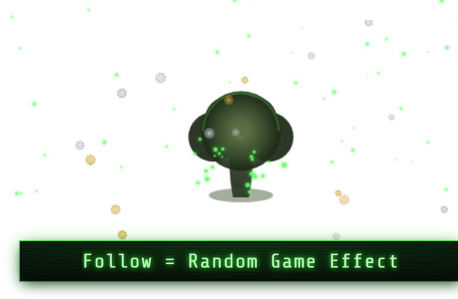

# Fallout 4 Follow Overlay — Pip-Boy

A **Fallout 4 / Pip-Boy** TikTok follow overlay. A terminal-green bar —
*Follow = Random Game Effect* — sits bottom-centre with a CRT-flicker glow and
scanlines. Pip-Boy-style icons peek up on idle, a TikFinity **follow** triggers
a six-phase **atomic** celebration (Vault Boy → RADSTORM charge → nuke flash →
bottle-cap burst → mushroom cloud), and a Vault-Tec registration terminal tracks
the dweller count.

Built on the canonical 1730-line Minecraft template — the architecture is
preserved 1:1 (440×260 stage, pulsing bar, 440×224 above-bar FX canvas, idle
peek-up sprites in round-robin, phased celebration timeline, screen shake,
follower counter sign, floating promo text, demo panel, TikFinity WebSocket at
`ws://localhost:21213/`). Per Clay's v2 direction the bar is **text-only** and
every sprite is hand-drawn on canvas in authentic Pip-Boy green — **no AI /
Replicate art, no external asset files**. Single self-contained file.

---

## Quick start (OBS)

1. **Sources → + → Browser**.
2. **URL**: `https://aquilo.gg/personal-overlays/follow-fallout4/`
   (backup: local `file:///…/aquilo-gg/overlays/follow-fallout4/index.html`).
3. **Width `1280`, Height `720`** (or your canvas size) — the bar anchors
   bottom-centre, the registration terminal and radstorm particles fill the
   canvas above it.
4. Tick **Shutdown source when not visible** + **Refresh browser when scene
   becomes active**.
5. The demo panel is **hidden by default** — add `?demo=1` to the URL to show it
   while testing, or press **H** to toggle.

## Idle peek roster (round-robin)

Vault Boy (thumbs-up) · Pip-Boy device · Deathclaw · Nuka-Cola · Power Armor
T-60 helmet · Brotherhood of Steel emblem · Vault-Tec vault door · Synth (Gen-1)
skull. Each is a code-drawn Pip-Boy-green icon with a 2.5D extrude, green glow,
and silhouette CRT scanlines.

## Follow celebration (≈3s)

`popIn 500 · idle 400 · charge 750 · boom 200 · smoke 850 · fade 300` ms —
Vault Boy bounces up with a thumbs-up, the Pip-Boy screen flickers with
*⚠ RADSTORM INCOMING ⚠* + white static and the stage shakes, then an atomic
flash + expanding ring bursts bottle-cap debris while Vault Boy becomes a
mushroom-cloud silhouette that drifts up through radstorm-green motes before a
quadratic fade back to idle. Thank-you: *"Vault Dweller @USERNAME has registered
with Vault-Tec."*

## URL params

| param | effect |
|-------|--------|
| `?demo=1` | show the demo panel (hidden by default for OBS) |
| `?particles=rads` *(default)* `\|dust\|none` | ambient particle layer |
| `?cycle=off` | don't cycle batch names on the terminal sign |
| `?shot=mobs` | static contact sheet of every idle sprite (screenshots) |
| `?freeze=popin\|idle\|charge\|boom\|smoke\|fade` | render one static celebration frame |
| `?signshot=N` | static render of the registration terminal at count N |
| `?fire=1` | auto-trigger a live follow on load (smoke-test) |

All screenshot params are inert during normal OBS use.
