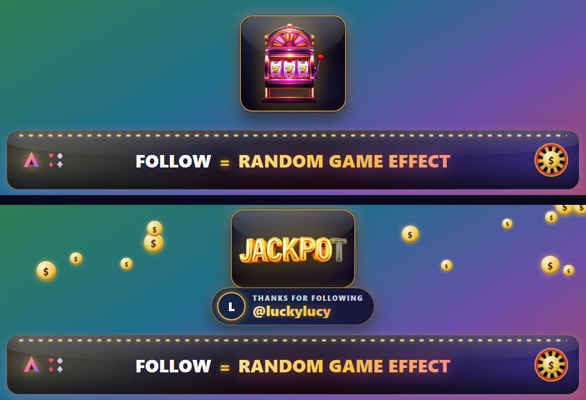

# GWYF Follow Overlay

A premium **Gamble With Your Friends** follow overlay for TikTok LIVE. A thin
glossy casino bar — **FOLLOW = RANDOM GAME EFFECT** — sits in the middle of the
vertical canvas. Game-themed sprites pop up above the bar on idle, and a
TikFinity **follow** event triggers a bigger celebration with the follower's
name and profile picture.



---

## Quick start (OBS)

1. **Sources → +  → Browser**.
2. **URL**: `https://aquilo.gg/personal-overlays/follow-gwyf/`
   (or a `file:///…/aquilo-gg/overlays/follow-gwyf/index.html` local path as a backup).

   > Hosting note: this overlay lives on `aquilo.gg` (Clay's personal overlays),
   > served from the `aquilo-site` repo at `public/personal-overlays/follow-gwyf/`.
   > It is **not** on the shared `widget.aquilo.gg` overlay site. Source of truth
   > stays here in the Loadout repo; copy changes into `aquilo-site` to redeploy.
3. **Width `1080`, Height `360`.**
4. Tick **Shutdown source when not visible** and **Refresh browser when scene
   becomes active** (so a fresh follow stream connects each session).
5. Position it so the **bar lands in your safe zone** — the bottom ~130px is
   the bar; the transparent space above is where pop-ups rise (it sits over
   your gameplay and is clear except during a pop-up).

The canvas is transparent, so it composites straight over your cam + gameplay.

---

## TikFinity connection

The overlay listens to TikFinity's **local WebSocket** for TikTok LIVE events.

1. Install and run **[TikFinity Desktop](https://tikfinity.zerody.one/)** and
   connect it to your TikTok LIVE.
2. TikFinity exposes a local WebSocket at **`ws://localhost:21213/`** — the
   overlay connects there by **default**, no config needed.
3. If your TikFinity uses a different port/path, pass it on the URL:
   `…/follow-gwyf/?tikfinity=ws://localhost:21213/`
4. The overlay auto-reconnects with exponential backoff if TikFinity restarts.

A real **follow** event arrives as JSON like:

```json
{ "event": "follow",
  "data": { "uniqueId": "user123", "nickname": "Display Name",
            "profilePictureUrl": "https://p16-sign…/avatar.jpeg" } }
```

The overlay reads `uniqueId` (→ `@handle`), `nickname` (→ avatar fallback
initial), and `profilePictureUrl` (→ avatar). Field-name variants across
TikFinity versions are handled defensively.

---

## URL parameters

| param       | default                  | what it does                                              |
|-------------|--------------------------|-----------------------------------------------------------|
| `tikfinity` | `ws://localhost:21213/`  | TikFinity WebSocket URL                                   |
| `assets`    | `./assets/`              | sprite base URL (e.g. a worker `/asset/…` prefix)         |
| `demo`      | `0`                      | `1` → auto-fire a sample follow every ~10s (testing)      |
| `debug`     | `0`                      | `1` → connection-status chip + a **simulate follow** button |

**Test it without going live:** open
`…/follow-gwyf/?demo=1` in a browser — you'll see idle pop-ups plus a looping
follow celebration. `?debug=1` adds a button to fire one on demand.

---

## What plays

- **Idle** (every 8–12s): a random sprite — slot machine, chip stack, dice,
  card fan, gold coin, JACKPOT text, royal flush, a die landing on 6, a VIP
  crown chip — rises above the bar, holds ~2s, fades.
- **Follow**: a larger celebration, rotating between **slot machine**, **royal
  flush**, and **coin rain**, with a *"Thanks for following @user"* card +
  avatar. Plays ~4.6s, then returns to the idle hero CTA.
- `prefers-reduced-motion`: idle pop-ups are skipped and the celebration is a
  simple fade — the static hero bar always remains.

---

## Assets

Premium sprites are pre-rendered (Replicate `flux-1.1-pro-ultra`, "Glossy Game
Premium" house style) and bundled in `assets/`. To regenerate:

```bash
# 1. render on a magenta chroma background  (needs REPLICATE_API_TOKEN)
cd discord-bot && node tools/replicate-gwyf-overlay-assets.mjs
# 2. key out the background → transparent finals in assets/
cd ../aquilo-gg/overlays/follow-gwyf && python keyout.py
```

`assets/_raw/` holds the keyed source renders and is not needed at runtime.
To serve the sprites from KV/worker instead of the bundled folder, upload them
and point the overlay at the prefix with `?assets=https://…/asset/follow-gwyf/`.

---

## Files

| file            | purpose                                            |
|-----------------|----------------------------------------------------|
| `index.html`    | bar + pop-up stage markup                          |
| `style.css`     | glossy casino bar, pop-up & celebration animations |
| `main.js`       | TikFinity WS client, idle loop, follow celebration |
| `keyout.py`     | chroma-key the raw renders to transparent PNGs      |
| `assets/`       | premium sprites (bundled)                           |
