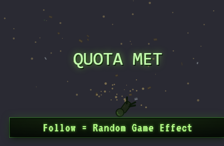

# Lethal Company Follow Overlay, Facility Terminal

A **Lethal Company** TikTok follow overlay. A facility-green terminal bar, *Follow = Random Game Effect*, sits bottom-centre with a CRT-flicker glow and
scanlines in low-fi monochrome green. Company-employee and monster icons peek up
on idle, a TikFinity **follow** triggers a six-phase **ship-takeoff** celebration
(employee → *SHIP LEAVING* alarm → QUOTA MET/FAILED slam → tumbling dead body +
scrap debris), and a **THE COMPANY** quota terminal tracks the count.

Built on the canonical Minecraft → Fallout 4 template, the architecture is
preserved 1:1 (440×260 stage, pulsing bar, 440×224 above-bar FX canvas, idle
peek-up sprites in round-robin, phased celebration timeline, screen shake,
follower counter sign, floating promo text, demo panel, TikFinity WebSocket at
`ws://localhost:21213/`). Per Clay's v2 direction the bar is **text-only** and
every sprite is hand-drawn on canvas in authentic facility green, **no AI /
Replicate art, no external asset files**. Font: **VT323** (CRT terminal). Single
self-contained file.

---

## Quick start (OBS)

1. **Sources → + → Browser**.
2. **URL**: `https://aquilo.gg/personal-overlays/follow-lethalcompany/`
   (backup: local `file:///…/aquilo-gg/overlays/follow-lethalcompany/index.html`).
3. **Width `1280`, Height `720`** (or your canvas size), the bar anchors
   bottom-centre, the company terminal and facility dust fill the canvas above.
4. Tick **Shutdown source when not visible** + **Refresh browser when scene
   becomes active**.
5. The demo panel is **hidden by default**, add `?demo=1` to the URL to show it
   while testing, or press **H** to toggle.

## Idle peek roster (round-robin)

Employee (jumpsuit + bubble helmet) · Bracken (leafy-backed humanoid) ·
Coil-Head (mannequin on a coiled spring) · Eyeless Dog (fanged splitting maw) ·
Jester (jack-in-the-box screaming head) · wall clock · metal pipe · yield sign.
Each is a code-drawn facility-green icon with a 2.5D extrude, green glow, and
silhouette CRT scanlines.

## Follow celebration (≈3s)

`popIn 500 · idle 400 · charge 750 · boom 200 · smoke 850 · fade 300` ms, the
employee bounces up, then a red/green ship-takeoff alarm flashes *! SHIP LEAVING
!* with static and a ramping shake, a giant **QUOTA MET** (or, ~22% of the time,
**QUOTA FAILED**) slams in with a scrap-shake, and a dead-employee body silhouette
tumbles away through scattering scrap bits + facility dust before a quadratic
fade back to idle. Thank-you: *"Employee @USERNAME has clocked in for The
Company."*

## URL params

| param | effect |
|-------|--------|
| `?demo=1` | show the demo panel (hidden by default for OBS) |
| `?particles=dust` *(default)* `\|spores\|none` | ambient particle layer |
| `?cycle=off` | don't cycle batch names on the terminal sign |
| `?shot=mobs` | static contact sheet of every idle sprite (screenshots) |
| `?freeze=popin\|idle\|charge\|boom\|smoke\|fade` | render one static celebration frame |
| `?signshot=N` | static render of the company quota terminal at count N |
| `?fire=1` | auto-trigger a live follow on load (smoke-test) |

All screenshot params are inert during normal OBS use.
