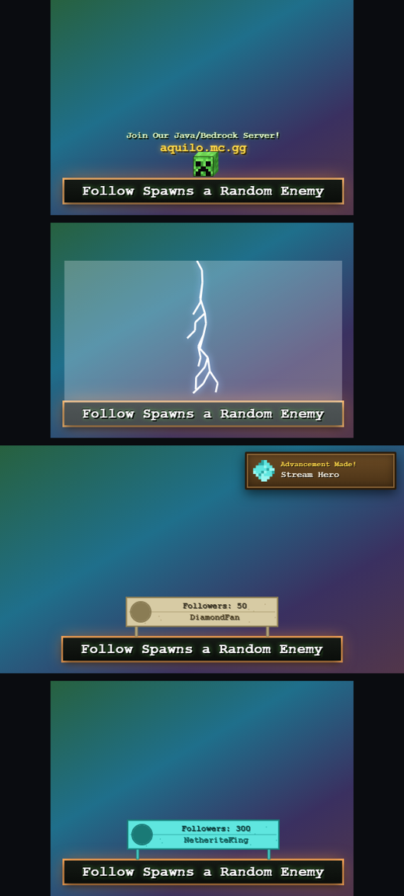

# Minecraft Follow Overlay, Premium

A premium **Minecraft** TikTok follow overlay. A thin pixel bar, *Follow Spawns
a Random Enemy*, sits at the bottom-centre of the canvas with a pulsing
day-night-tinted glow. 3D mob heads peek up on idle, a TikFinity **follow**
triggers one of seven randomized celebration scenes, milestones unlock
Minecraft-style advancement toasts, and an ambient particle layer drifts behind
it all.

Built on the canonical 1730-line Minecraft template, the architecture is
preserved (440×260 stage, pulsing bar, above-bar FX canvas, 3D pseudo-isometric
pixel-cube renderer, phased celebration timelines, screen shake, follower
counter, demo panel, TikFinity WebSocket). Single self-contained file; every
sprite is drawn procedurally on canvas, no external assets.

---

## Quick start (OBS)

1. **Sources → +  → Browser**.
2. **URL**: `https://aquilo.gg/personal-overlays/follow-minecraft/`
   (backup: local `file:///…/aquilo-gg/overlays/follow-minecraft/index.html`).
3. **Width `1280`, Height `720`** (or your canvas size), the bar anchors
   bottom-centre, advancement toasts appear top-right, ambient particles fill
   the canvas.
4. Tick **Shutdown source when not visible** + **Refresh browser when scene
   becomes active**.
5. Press **H** to hide the demo panel before going live (top-left).

---

## TikFinity connection

Listens to TikFinity's local WebSocket for TikTok LIVE follow events.

1. Run **[TikFinity Desktop](https://tikfinity.zerody.one/)** connected to your LIVE.
2. It exposes `ws://localhost:21213/`, the overlay connects there by default
   (the demo panel **WS** chip shows the state).
3. Different port? Append `?tikfinity=ws://localhost:PORT/`.
4. Auto-reconnects every 5s.

A follow arrives as `{ "event":"follow", "data":{ "nickname":…, "uniqueId":…,
"profilePictureUrl":… } }`, name + pic drive the thank-you card, counter, and
milestone tracking.

---

## URL parameters

| param        | values                                   | what it does                                            |
|--------------|------------------------------------------|---------------------------------------------------------|
| `tikfinity`  | `ws://host:port/`                        | TikFinity WebSocket URL (default `ws://localhost:21213/`) |
| `particles`  | `souls` `snow` `leaves` `sparks` `none`  | ambient particle type (default: auto-rotates every 5 min) |
| `cycle`      | `off` `dawn` `noon` `dusk` `midnight`    | force a day-night phase (`off` = static noon; default: 20-min cycle) |
| `textures`   | `<url>` `off`                            | base URL for real mob textures (default `./textures/`; `off` = procedural only) |
| `shot`       | `idle` `mining` `<scene>` `advancement` `counter` `dusk` | freeze a state for screenshots |

`<scene>` = `creeper` `tnt` `lightning` `dragon` `beacon` `enderpearl` `wither`.

---

## What plays

- **Idle** (every 4-8s): **70%** a 3D mob head, creeper, zombie, skeleton,
  enderman, witch, blaze, slime, wither skeleton, allay, axolotl, peeks up
  (round-robin), bobs, lowers. **30%** a **mining** event: a pickaxe cracks a
  dirt block 0→9, it breaks, and a random item (diamond / emerald / iron / gold
  / ancient debris / heart of the sea / nether star) floats up with sparkles.
- **Follow → one of 7 weighted celebration scenes**: **creeper boom** (×3),
  **TNT chain** (×2), **lightning strike** (×2), **ender dragon flyby**, **beacon
  activation** (rainbow beam), **ender pearl teleport**, **wither boss reveal**.
  Each has its own phased timeline + screen shake + a sound-free impact frame
  (white flash + stage scale-punch) on the hit.
- **Thank-you**: emerald sparkle + XP-orb burst around the follower's pic; the
  name renders in Minecraft chat-colour (rainbow at 100+ followers).
- **Follower counter** sign, tiered by total: **oak → spruce → birch → iron →
  gold → diamond → netherite** block frame.
- **Milestones** (10/25/50/100/250/500/1000): a Minecraft **advancement toast**
  slides in top-right, *"Advancement Made!"* + the rank name + an
  emerald/diamond/netherite/nether-star icon.
- **Every 10 followers**: the bar gets a 3s **enchantment-table shimmer**
  (purple glow + scrolling Standard Galactic runes).
- **Ambient**: drifting particles (souls/snow/leaves/sparks) + a 20-minute
  **day-night cycle** that tints the bar glow dawn→noon→dusk→midnight and fades
  in stars at night.
- **Server invite**: a hovering *"Join Our Java/Bedrock Server!"* line with
  **aquilo.mc.gg** beneath it bobs above the bar during idle.

---

## Minecraft textures

The 3D mob cubes use **real Minecraft mob-face textures** for the front face,
with the cube's top/side faces procedurally shaded to match. The ten vanilla
faces are bundled in `textures/` (head front-face crops from the default
resource pack, `creeper.png`, `zombie.png`, `skeleton.png`, `enderman.png`,
`witch.png`, `blaze.png`, `slime.png`, `wither_skeleton.png`, `allay.png`,
`axolotl.png`). Enderman gets its glowing-eye overlay; slime its inner-core
eyes composited in.

To swap them (e.g. a custom resource pack), either replace the PNGs in
`textures/` or host your own folder and pass `?textures=https://your-host/path/`.
Each file is an 8×8 (or 16×16) front-face crop, scaled to the cube face. Any
missing file falls back to the built-in procedural pixel-art; `?textures=off`
forces procedural.

> Face crops are derived from the vanilla Minecraft resource pack for use in
> Aquilo's own stream overlay (Minecraft assets © Mojang/Microsoft).

---

## Demo panel (top-left)

Trigger 1 / batch follows, force a specific celebration scene, trigger a mining
event, auto-loop random follows, and a WS status chip. **H** toggles it.

---

## Files

Single file, `index.html`. (`preview.png` is just the README image.)
Per-game variants swap theme tokens; see the GWYF overlay for the casino reskin.
