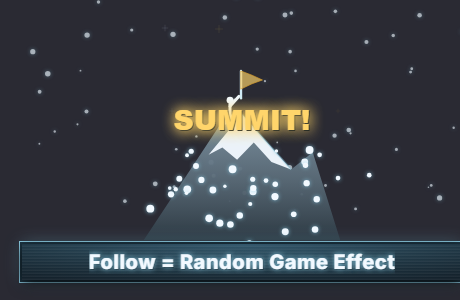

# PEAK Follow Overlay — Summit Climb

A **PEAK** (co-op mountain climbing) TikTok follow overlay. An alpine ice-blue
bar — *Follow = Random Game Effect* — sits bottom-centre with a frosty glow and
gentle breathe pulse in crisp white-blue **Inter**. Climber/biome icons peek up
on idle, a TikFinity **follow** triggers a six-phase **summit** celebration
(climber → SUMMIT PUSH gust → bright flash → a mountain rises → a gold flag is
planted → snow settles), and an alpine trail sign tracks the summit count.

Built on the canonical FO4/Minecraft template — the architecture is preserved
1:1 (440×260 stage, pulsing bar, 440×224 above-bar FX canvas, idle peek-up
sprites in round-robin, phased celebration timeline, screen shake, follower
counter sign, floating promo text, demo panel, TikFinity WebSocket at
`ws://localhost:21213/`). The bar is **text-only**; every sprite is hand-drawn
on canvas in the alpine palette (ice-blue `#88c8e0`, snow `#f2f9ff`, slate rock
`#5a6b78`, summit-gold `#ffd56b`) — **no AI art, no external asset files**.
Single self-contained file.

---

## Quick start (OBS)

1. **Sources → + → Browser**.
2. **URL**: `https://aquilo.gg/personal-overlays/follow-peak/`
   (backup: local `file:///…/aquilo-gg/overlays/follow-peak/index.html`).
3. **Width `1280`, Height `720`** — the bar anchors bottom-centre, the trail
   sign and snow particles fill the canvas above it.
4. Tick **Shutdown source when not visible** + **Refresh browser when scene
   becomes active**.
5. The demo panel is **hidden by default** — add `?demo=1`, or press **H** to toggle.

## Idle peek roster (round-robin)

Climber reaching · Climber hanging · Climber mid-stride · Snow-capped peak ·
Ice-axe / pick · Glowing cave gem · Snow-dusted pine · Biome mushroom. Each is a
code-drawn alpine icon with a 2.5D extrude, ice-blue glow, and frost sheen.

## Follow celebration (≈3s)

`popIn 500 · idle 400 · charge 750 · boom 200 · smoke 850 · fade 300` ms — a
climber bounces up reaching, the wind/snow **gust** intensifies with flickering
*SUMMIT PUSH* text and the stage shakes, then a bright summit flash + expanding
ring bursts gold/white sparkle glints while a big snow-capped **mountain rises**
and a climber silhouette **plants a gold flag** under big **SUMMIT!** text;
drifting snowflakes settle and the flag waves before a quadratic fade.
Thank-you: *"@USERNAME has reached the summit."*

## Counter sign

A wooden alpine trail plank (wood-grain, ice-blue routed border, carved gold
summit-marker icon) — header **PEAK SUMMIT LOG**, body **SUMMITS: \<total\>** /
**LAST: @name**, cycling recent batch names.

## URL params

| param | effect |
|-------|--------|
| `?demo=1` | show the demo panel (hidden by default for OBS) |
| `?particles=snow` *(default)* `\|dust\|none` | ambient particle layer |
| `?cycle=off` | don't cycle batch names on the trail sign |
| `?shot=mobs` | static contact sheet of every idle sprite (screenshots) |
| `?freeze=popin\|idle\|charge\|boom\|smoke\|fade` | render one static celebration frame |
| `?signshot=N` | static render of the trail sign at count N |
| `?fire=1` | auto-trigger a live follow on load (smoke-test) |

All screenshot params are inert during normal OBS use.
